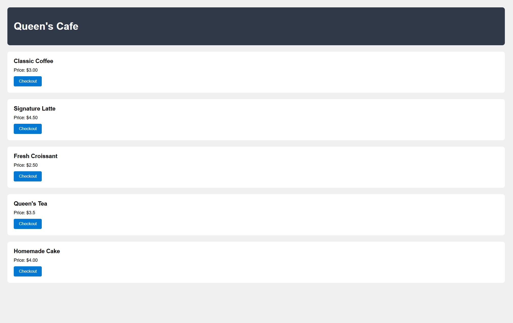
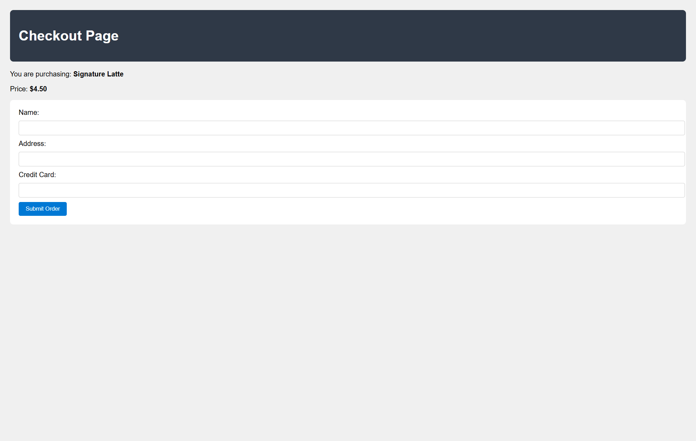
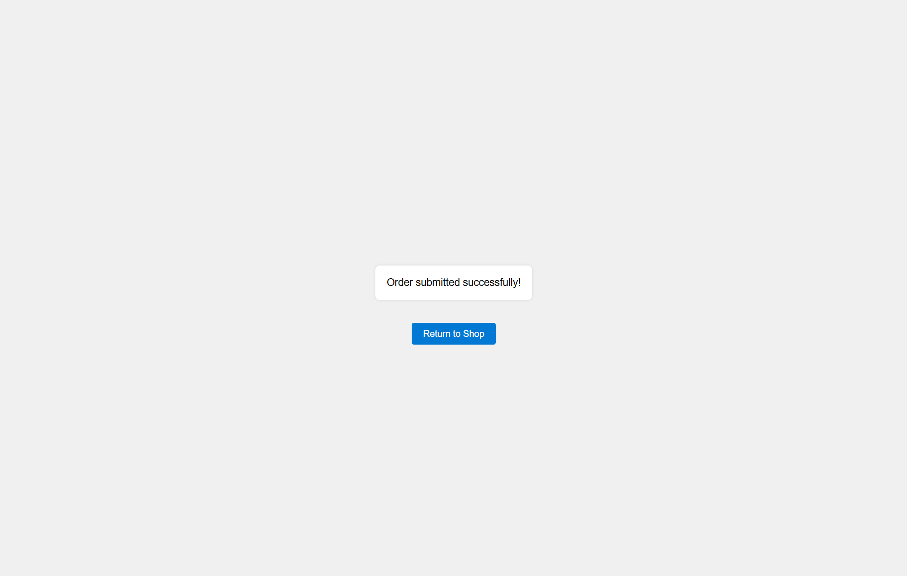
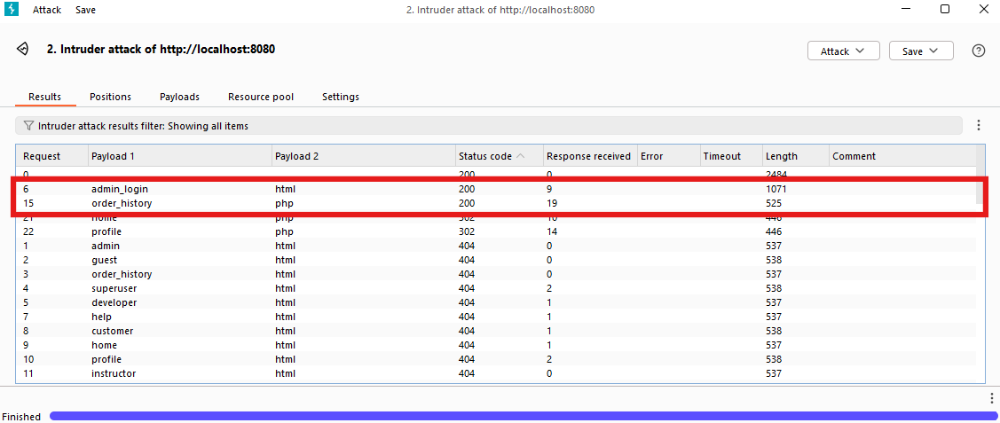
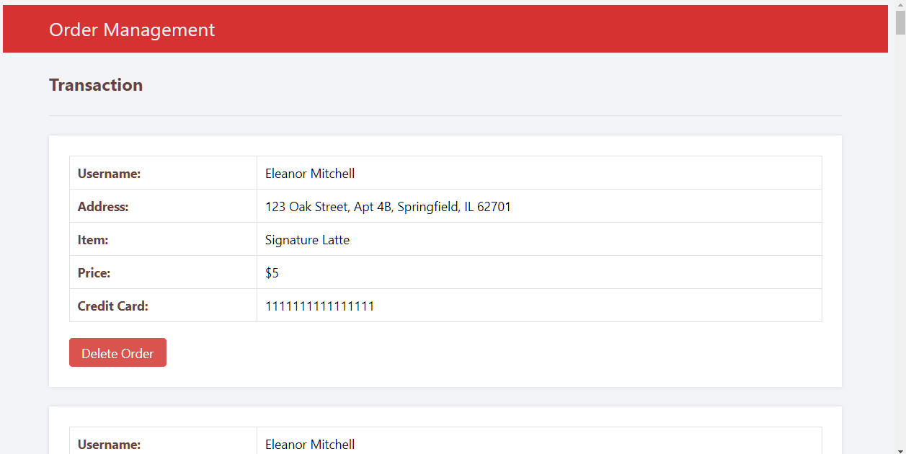

# Purpose
This is a vulnerable website named **Queen's Cafe**, designed as a web exploit target by the OSS course "Team LuckyQueen". The website is intentionally vulnerable to Forced Browsing, Brute Force, and SQL Injection attacks.

When this website is hosted, users can only view these pages:

| shop | checkout | process_order |
| --- | --- | --- |
|  |  | |

Can you:
- Use `Forced Browsing` to find other hidden pages? (These pages will extensively use the color red.)
- Use `Brute Force` or `SQL Injection` to log into the administrator's account, and find valuable information?

 
  
# Setup

### Prerequisite
- Clone this repository to your local machine.
- Have XAMPP installed.

### Environment Setup
Complete the following steps.

#### Step1. Database Setup
- Locate your database folder. `e.g., c:/xampp/mysql/data/` 
- Copy the folders `/<repo>/oss_checkout/` and `/<repo>/phplogin/` into your database folder. `e.g., c:/xampp/mysql/data/oss_checkout/` and `e.g., c:/xampp/mysql/data/phplogin/`

#### Step2. Website Setup
- Locate your Apache web server's root folder. `e.g., c:/xampp/htdocs/`
- Copy folder `/<repo>/web/` to your Apache web server's root folder. `e.g., c:/xampp/htdocs/web/`

#### Step3. Start the Website and the Database
- Start XAMPP
- Start the Apache by clicking the `Start` button next to `Apache`
- Start the MySQL by clicking the `Start` button next to `MySQL`
- Navigate to your website: `http://localhost:<your_port>/web`

 

# Exploit
### Find Hidden Files
- Hint:
  - Use BurpSuite
    - Intruder
    - Cluster Bomb
  - Use payloads
	- `<repo>/attack/forced_browsing_payload1.txt`
	- `<repo>/attack/forced_browsing_payload2.txt`
- Finish Condition:
  - BurpSuite should show this result   
   

### Find Credit Card Information
- Hint:
  - `admin_login` page
  - Perform SQL injection attack or
  - Brute force attack
    - Intruder
    - Cluster Bomb
  - Use payloads
    - `<repo>/attack/brute_force_payload1.txt`
    - `<repo>/attack/brute_force_payload2.txt`
- Finish Condition:
  - Find the page that reveals all customer's credit card information   
     

# Reference
1. [Secure Login System with PHP and MySQL](https://codeshack.io/secure-login-system-php-mysql/)
2. [phpMyAdmin Tutorial and MySQL Tutorial Course](https://www.youtube.com/watch?v=j1WVRtcauqw&list=PLk-EmIiBIYGF8WCitdIVq7dvvacqY0rdl&index=4&ab_channel=NickFrostbutter)
3. [How to install XAMPP on Windows?](https://www.geeksforgeeks.org/how-to-install-xampp-on-windows/)